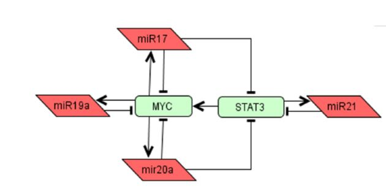
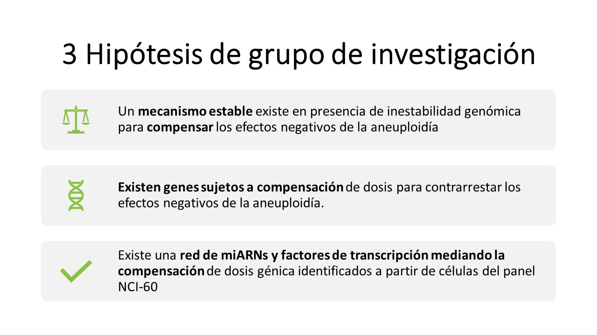
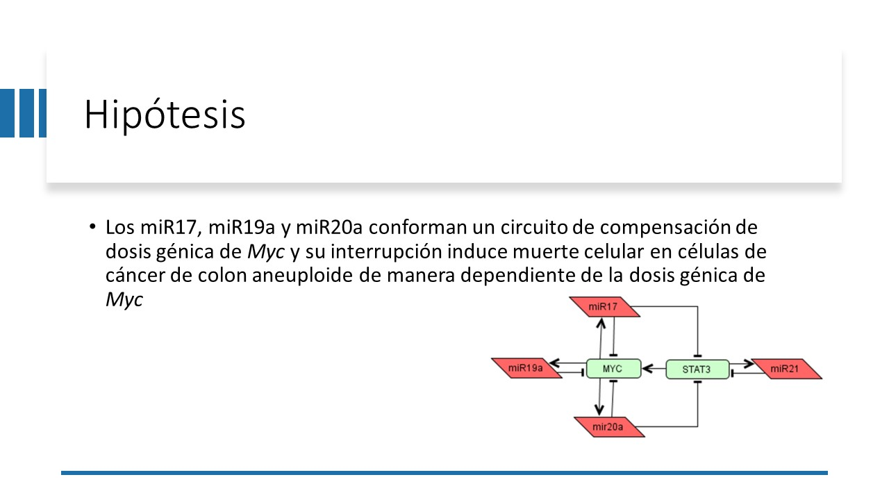
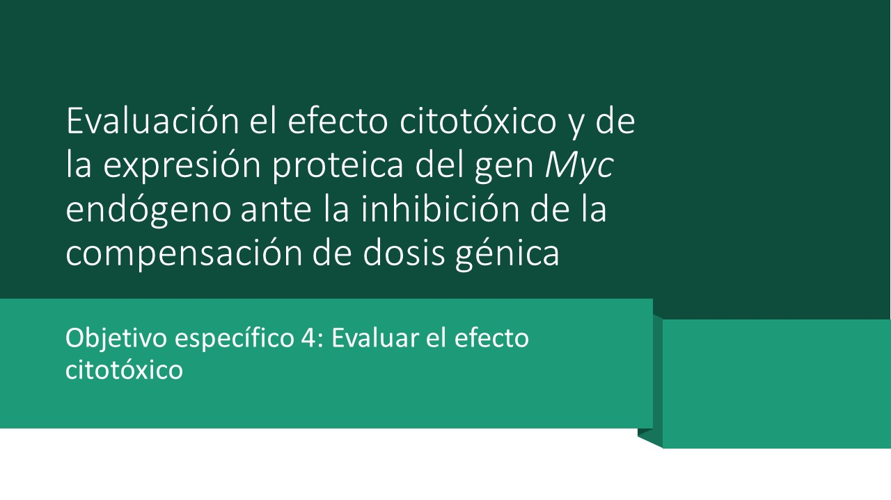
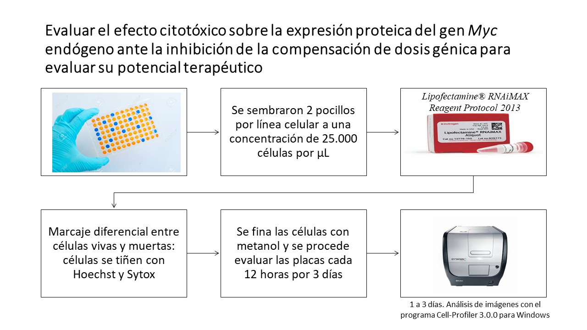

```{r, echo=FALSE}

library(knitr)
opts_knit$set(root.dir = "C:/Users/Karol-PC/Desktop/ProyectoFinal-CodigoReproducible", eval = TRUE, echo = FALSE)

DatosSW620<- read.csv("CSV_SW620_formato_largo.csv")
DatosSW620


DatosHCT15<- read.csv("CSV_HCT15_formato_largo.csv")
DatosHCT15

DatosHT29<- read.csv("CSV_HT29_formato_largo.csv")
DatosHT29

# Variables

# Tratamiento
#1 = anti-miARNs
#0 = control

# Condición
#1 = todas las células
#0 = células muertas

# Tiempo
#1 = 0 horas 
#2 = 12 horas
#3 = 24 horas
#4 = 36 horas
#5 = 48 horas
#6 = 60 horas
#7 = 72 horas 

```
 
# Validación experimental del fenómeno de compensación de dosis génica del oncogén MYC en líneas celulares de cáncer de colón aneuploide del panel NCI-60.

Según datos de la Oganización  Mundial de la Salud (OMS), el cáncer se coloca como la segunda causa de muerte a nivel mundial con un estimado de casi 10 millones de muertes para el 2018 y 18.1 millones de personas diagnósticadas con este padecimiento.

El cáncer se define como un grupo o conjunto de enfermedades que se caracteriza por tener una progresión de un estado saludable de las células a un estado maligno con patrones de divisiones anormales y capacidad propagativa hacia otros tejidos [@ManSaiAcon-Chan2018] 

De los "hallmarks" o características más prominentes que presenta el cáncer tenemos la inestabilidad genómica. Este hallmark se encuentra en relación estrecha con los cariotipos aneuploides -malignos- de las células cancerígenas [@Hanahan2011;@Acon-Chan2018]. Y a pesar de las aneuploidias son incompatibles con la vida en estado germinal y de desarrollo (solo con la excepción de la trisomía del cromosoma 21), en células tumorales les confiere ventajas adaptativas. Sin embargo, la célula necesita de mecanismos compensatorios para no caer en estados de desesquilibrio de proteínas y en consecuencia su muerte por citotoxicidad [@Ben-David2019; @Salmina2019]

Diferentes estudios han encontrado que estos mecanismos regulatorios pueden ir desde regulaciones epigenéticas, pasando por todo los niveles de regulación normal de la célula hasta la post-traducción de la proteína. Es por eso que investigadores se han dado la tarea de investigar como oncogenes específicos, median una compensación génica, por medio de modelos matemáticos generados con herramientas de biología en sistemas. Uno de estos modelos propone que el gen Myc esta compensado por tres miARNs, y por eso a pesar de que su número de genes es alterado a la alza en más de 70% de los cáncer, sus niveles de proteínas se mantienen estables [@ManSaiAcon-Chan2018]

### Diagrama causal



## Hipótesis del trabajo 

Este proyecto nace a partir del desarrollo de un conjunto de científicos utilizando herramientas de biología de sistemas, por lo que primero se plantearon tres hipotesis de grupo que fueron encausando la hipotesis final de tesis



Por lo que el objetivo radica en: determinar si el bloqueo de los miR17, miR19a y miR20a puede alterar la compensación de dosis génica en el gen Myc ocasionando muerte controlada en células aneuploides de cáncer colorrectal

## ¿Cuál es la pregunta específica de investigación?

¿Son los miARNs miR17, miR19a, miR20a, los encargados de mediar la compensación de dósis génica en líneas celulares de cáncer colorectal del panel NCI-60?

## Diseño experimental: Comprobación de la citotoxicidad mediada por los anti-miARNs

Para función de este trabajo, se va a validar nada más el objetivo específico 4 del proyecto de tesis (datos disponibles):


### Procedimiento específico seguido para generar los datos para este ejercicio
### ¿De dónde vienen los datos?

Se cultivaron las líneas celulares SW620, HT29 y HCT15 a una concentración de 25 000 células por µL, en cada pocillo de placas de 96 pozos con medio RPMI 1640 completo, y se incubaron aproximadamente 18 horas por la noche a 37°C y 5% CO2. Cumplido el tiempo se retiró el medio y se realizó una tinción con 50 µL de colorante fluorescente azul Hoechst (Thermo Fisher) 1/8000 por 10 minutos para teñir el ADN de los núcleos de las células vivas, posteriormente se removió la solución y se realizó un lavado con PBS (Gibco®). Luego, se añadieron 150 µL del colorante fluorescente SYTOX® GREEN (Thermo Fisher) 1/ 20 000, que se caracteriza por ser no permeable en células vivas, lo que lo hace un buen indicador de células muertas, su pico de emisión se encuentra en 523 nm (Thermo Fisher, 2020).

Simultáneamente, se realizó el procedimiento indicado en Lipofectamine® RNAiMAX Transfection Protocol (Thermo Fisher, 2013) para 96 pocillos, y se agregaron posterior a las tinciones con Hoechst y SYTOX® GREEN 10 µL de concentraciones de 5 µM ,10 µM y 20 µM, tanto de control negativo (ThermoFisher mirVanaTM custom miRNA inhibitor) como de una mezcla de anti-miARN 17, 19a y 20a (ThermoFisher), siguiendo una relación de 1 ADN: 3 Lipofectamina, por duplicado para cada condición. Posteriormente se realizó una cinética en el tiempo por 72 horas en el microscopio automatizado de fluorescencia Cytation 3 (BIOTEK), realizando lecturas cada 12 horas en donde se obtuvieron 4 imágenes que representan distintas zonas de los pocillos, por lo que al final de la cinética se obtienen 8 imágenes por cada condición en 7 tiempos distintos

## Resumen del procedimiento 



Importante que las tres líneas celulares utilizadas son de cáncer colorrectar y tiene números distintos para la cantidad de copias del gen Myc (son anueploides para el Myc):
SW620 7 copias de Myc
HT29 4 copias de Myc
HCT15 2 copias de Myc

### Procesamiento de los datos y análisis estadístico 

Para los análisis estadísticos se procesaron cada una de las imagenes obtenidas a partir del Cytation, con el programa CellProfiler usando un pipeline que buscaba identificar objetos primarios, corrección de la ilumación y la identificación de objetos secundarios para dos canales de color distintos (DAPI y Sytox) se determinaron cuales eran las células totales vs las células muertas.

AL final se aplicó la prueba t-student (separado para cada línea) de cada uno de los tratamientos en función del tiempo para identificar si habian diferencias significativas en los porcentajes de mortalidad de cada una de las líneas celulares en dependencia de la concetración de anti-miARNs que se estaba utilizando

## DAG
## ¿Cuáles son las variables relevantes y cuál es su relación, conocida y/o hipotética?

En este caso se pueden evaluar dos tipos de DAG, el primero relacionado con la hipótesis de la tesis, en donde se cree que los tres miARNs van a regular la compensación de dósis génica de Myc y el segundo específico para el objetivo 4: determinar la citotoxicidad de los anti-miRs para cada una de las tres líneas celulares a traves del tiempo

### DAG de la hipótesis de la tesis

Aca las variables relevantes son los tres miARNs (miR17, miR19a y miR20a) y su relación hipotética de su efecto en la compensación de dósis génica de Myc

```{r}

library(dagitty)
library(ggdag)
library(wesanderson)

CompensacionMyc <- dagify (Myc~miR17,
                           Myc~miR19a,
                           Myc~miR20a,
                           outcome = "Myc",
                           labels = c(Myc= "Compensación de dosis génica"))

ggdag(CompensacionMyc, layout = "circle", node_size = 20) + theme_dag()

```

### DAG de la comprobación de la citotoxicidad mediada por los anti-miARNs

En este caso debemos de tomar en cuenta que se utilizaron tres líneas celulares de cáncer colorrectal del panel NCI-60 para. Estas líneas celulares son aneuploides (tienen una cantidad aberrante de cromosomas en su genoma) para el gen Myc, y lo que se busca es determinar experimentalmente si la regulación por miARNs es dependiente de la dosis génica, es decir, se espera que aquellas líneas celulas con más copias del gen Myc tengan un porcentaje de mortalidad más alto mediado por los anti-miRs.

Por eso se considera pertinente agregar en el DAG, que la aneuploidia afecta distintivamente cada línea celular, y que a su vez va a afectar la cantidad de mARN de MYC y en consecuencia, si la carga mutacional por aneuploidia es más alta, así va a afectar también la mortalidad de las células en función del tiempo. 

```{r}

citotoxicidad <- dagify(ANEUP~LC,
                        Mort~Tiempo,
                        mARN~ANEUP,
                        mARN~AntimiRs,
                        Mort~mARN,
                        outcome = "Mort")

ggdag(citotoxicidad, layout = "circle", node_size = 25) + theme_dag()

```

## Análisis de los datos

```{r}

#instalar dplyr
library(dplyr)

#Los datos en bruto van a estar organizados por CSV individuales por línea celular. Entonces se va a utilizar el paquete dplyr para eliminar columnas vacias que se generaron a partir de la conversion de excel a csv con "select", se agregó la columna para especificar la línea celular con "mutate" y finalmente se movio al principio de tabla con la función "relocate"

SW620 <- DatosSW620  %>% select(-c(7:20))
SW620 <-SW620 %>% mutate (Linea_celular = "SW620")
SW620 <-SW620 %>% relocate (Linea_celular, .before = Anti.miARNs)
SW620

HT29 <- DatosHT29  %>% select(-c(7:20))
HT29 <- HT29 %>% mutate (Linea_celular = "HT29")
HT29 <- HT29 %>% relocate (Linea_celular)
HT29

HCT15 <- DatosHCT15 %>% mutate (Linea_celular = "HCT15")
HCT15 <- HCT15 %>% relocate (Linea_celular)
HCT15

#Una vez que cada una de las tablas individuales se procesó, se van a combinar para tener una tabla completa con las tres líneas celulares con la función "bind_rows" y se genera un nuevo documento csv con estos datos.

Citotoxicidad <- bind_rows(HCT15,HT29,SW620)
Citotoxicidad
write.csv(Citotoxicidad, file = "DatosProcesadosTotales.csv", row.names = FALSE, quote = FALSE)

#Es importante tomar en cuenta que se va a buscar normalizar o extrapolar los datos.

#Esta extrapolación se hace asumiendo que al tiempo 1 (0 horas) todos los pocillos están a un 100% (para ambas condiciones).

#Entonces se va a crear un for loop que nos permite hacer este cálculo dentro de la tabla. Es importante tomar en cuenta que para la condición "Recuento" hay que especificar que va a ser solo para la variable 1, esto porque todos los datos respectivos a cada concentración y cada línea celular se van a dividir siempre contra el tiempo 1 (incluyendo recuento de células totales y células muertas).

#La función "Citotoxicidad$Fluor.Norm[m] <-Citotoxicidad$Fluorescencia[m] / Temp" es la que va realizar la división de cada uno de los tiempos entre el tiempo 1 para poder normalizar nuestros datos.


Tiempos <- unique(Citotoxicidad$Tiempo)
Anti.miARNs <- unique(Citotoxicidad$Anti.miARNs)
Linea.celular <- unique(Citotoxicidad$Linea_celular)
Replicas <- unique(Citotoxicidad$Replicas.)
concentracion <- unique(Citotoxicidad$Concentracion)
Recuento <- unique(Citotoxicidad$Recuento_Celular)

m=1

for (i in 1:length(Linea.celular)) {
  for (k in 1:length(concentracion)) {
    for (j in 1:length (Anti.miARNs)) {
      for (l in 1:length(Recuento)) {
        for (p in 1:length(Tiempos)) {
          for (n in 1:length(Replicas)) {
            Temp <- Citotoxicidad$Fluorescencia [which(
              Citotoxicidad$Linea_celular == Linea.celular[i] &
                Citotoxicidad$Concentracion == concentracion[k] &
                Citotoxicidad$Anti.miARNs == Anti.miARNs[j] &
                Citotoxicidad$Recuento_Celular == Recuento[1] &
                Citotoxicidad$Replicas. == Replicas[n] &
                Citotoxicidad$Tiempo == Tiempos[1]
            )]
            Citotoxicidad$Fluor.Norm[m] <-
              Citotoxicidad$Fluorescencia[m] / Temp
            m = m + 1
          }
        }
      }
    }
  }
}

#Ahora que ya se tiene normalizados los datos (dentro de la tabla se puede ver una nueva conlumna que se llama "Fluor.Norm" vamos a calcular el porcentaje de mortalidad ("PorcentajeMort") simplemente tomando la normalización del subgrupo de las células muertas y se multiploca por 100 (para sacar ese porcentaje de mortalidad)

CelulasMuertas <- Citotoxicidad[which(Citotoxicidad$Recuento_Celular == 0),]
CelulasMuertas

CelulasMuertas$PorcentajeMort<- CelulasMuertas$Fluor.Norm*100

#De nuevo, se tiene que procesar la tabla para poner como factor no numero la columna de "Tratamiento" categorizando el 0 como control y la respectiva concentración de anti-miARNs utilizada, para poder eventualmente hacer la comparación del porcentaje de mortalidad entre tratamiento vs control

for (i in 1:nrow(CelulasMuertas)) {
  if (CelulasMuertas$Anti.miARNs[i] == 0) {
    CelulasMuertas$Tratamiento[i] <- "Control"
  }
  else {
    CelulasMuertas$Tratamiento[i] <-
      paste0(CelulasMuertas$Concentracion[i], "uM")
  }
}

#Modelo estadístico: finalmente se procede a hacer el modelo estadistico, con modelo lineal, viendo como el porcentaje de mortalidad va a estar afectado por la interracción entre la línea celular, la concentración de miARN utilizada (tratamiento) y el tiempo. 

Mod1 <- lm(PorcentajeMort~ Linea_celular*Tratamiento*Tiempo, data=CelulasMuertas)
summary(Mod1)

anova(Mod1)

#Gráfico del procentaje de mortalidad en función del tiempo por cada línea celular

#install.packages("effects")

library(effects)
library(psych)
library(ggplot2)

Efectos <- allEffects(Mod1)
Efectos

plot(Efectos, multiline=TRUE, confint=TRUE, ci.style="bars"
     ,xlab="Tiempo"
     ,ylab="Mortalidad (%)")

#https://rpubs.com/palday/mixed-interactions

#Se pueden pasar los datos a un data frame para poder montarlo con un ggplot

Efectos1 <- Efectos[[1]]
EfeDF <- as.data.frame(Efectos1)
g <- ggplot(EfeDF, aes(x=Tiempo, y=fit,color = Tratamiento, shape = Tratamiento, ymin=lower,ymax=upper)) + geom_pointrange(position=position_dodge(width=.1))
plot(g)
```

## Interpretación breve de los resultados con respecto a la  pregunta de investigación y la hipótesis causal
#### Máximo un párrafo

Si analizamos nuestros datos desde el ANOVA, lo que vamos a obtener es que existe significancia para todas las variables: línea celular, tratamiento, tiempo y las respectivas interacciones entre estas variables. Es decir, la mortalidad de nuestras celulas, va a ser diferente en cada una de las tres líneas utilizadas, a través del tiempo a concentraciones distintas del anti-miARN.Sin embargo, si nos vamos al modelo linear a evaluar cada una de esas interraciones por separado, lo que se obtiene es que la línea SW620 es la que va a tener significancia con respecto al porcentaje de mortalidad, lo cuál, es lo esperado ya que esta línea de copias es la que tiene un número mayor de copias del gen Myc, por lo que su compensación debe ser mas "estricta" y cualquier disrupcion en esa homeostasis proteica de MYC nos va a llevar a muerte por proteotoxicidad (porque hay muchas copias de Myc, generando mucho mARN para MYC y en consecuencia muchisimas unidades de la proteína MYC). Por otra parte el tiempo se determina como un factor influyente en la mortalidad porque aunque sea poco el desbalance que va a ir produciendo los anti-miARNs, este desequilibrio genera acumulación progresiva del daño y en consecuencia aumenta la mortalidad. Por ultimo, las concentraciones de 20uM y 5uM podrían estar influenciando el porcentaje de mortalidad.

## Información de la sesión

```{r InformacionSesion, echo = FALSE, include = TRUE}
sI <- sessionInfo()
sI
```